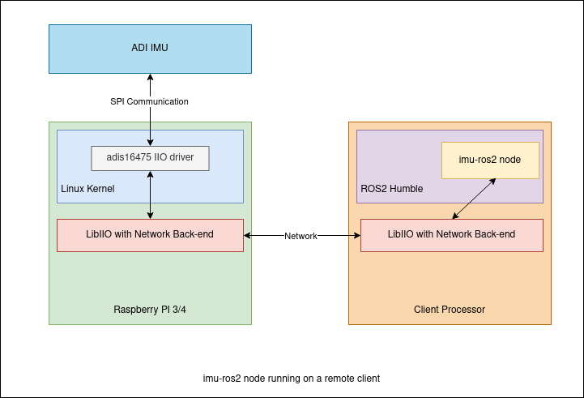
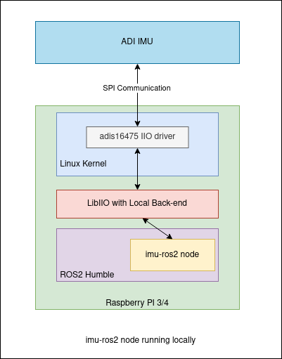
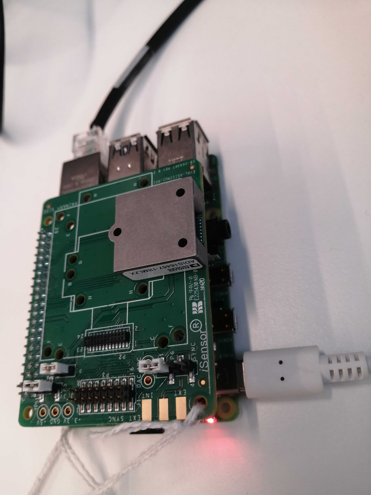
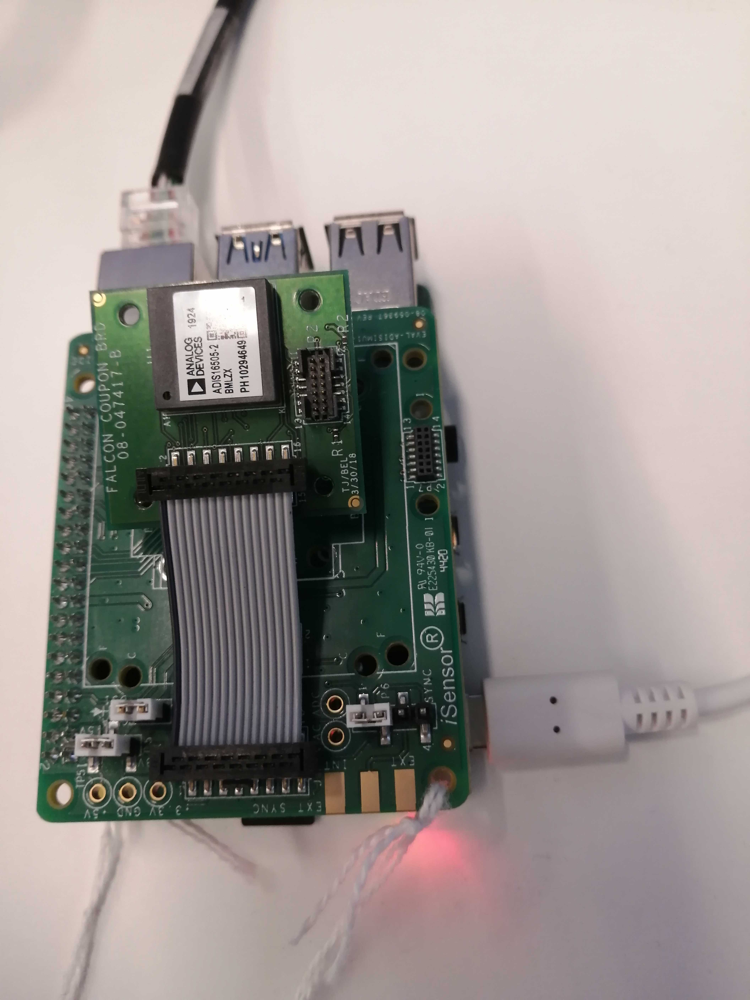

ROS2 drivers for ADI's IMUs
===========================

.. contents::
    :depth: 2

Supported Devices
-----------------

* `ADIS16465 <https://www.analog.com/ADIS16465>`_
* `ADIS16467 <https://www.analog.com/ADIS16467>`_
* `ADIS16470 <https://www.analog.com/ADIS16470>`_
* `ADIS16475 <https://www.analog.com/ADIS16475>`_
* `ADIS16477 <https://www.analog.com/ADIS16477>`_
* `ADIS16500 <https://www.analog.com/ADIS16500>`_
* `ADIS16501 <https://www.analog.com/ADIS16501>`_
* `ADIS16505 <https://www.analog.com/ADIS16505>`_
* `ADIS16507 <https://www.analog.com/ADIS16507>`_
* `ADIS16545 <https://www.analog.com/ADIS16545>`_
* `ADIS16547 <https://www.analog.com/ADIS16547>`_
* `ADIS16575 <https://www.analog.com/ADIS16575>`_
* `ADIS16576 <https://www.analog.com/ADIS16576>`_
* `ADIS16577 <https://www.analog.com/ADIS16577>`_

Overview
--------

Analog Devices offers a series of precision, miniature microelectromechanical
system (MEMS) inertial measurement units (IMUs) that include a triaxial
gyroscope and a triaxial accelerometer. Each inertial combines with signal
conditioning that optimizes dynamic performance.

The factory calibration characterizes each sensor for sensitivity, bias,
alignment, linear acceleration (gyroscope bias), and point of percussion
(accelerometer location). As a result, each sensor has dynamic compensation
formulas that provide accurate sensor measurements over a broad set of
conditions.

Applications
------------

* Navigation, stabilization, and instrumentation
* Unmanned and autonomous vehicles
* Smart agriculture and construction machinery
* Factory/industrial automation, robotics
* Virtual/augmented reality
* Internet of Moving Things

Using imu-ros2 repository
-------------------------

This repository implements a ROS2 node that reads data from ADI IMU devices and
publishes the read data on various topics. The node is also able to configure
the IMU devices.

Prerequisites
^^^^^^^^^^^^^

imu-ros2 can be used with ROS2 humble distribution. To install it you may follow
the documentation available here: https://docs.ros.org/en/humble/Installation.html

imu-ros2 is using LibIIO v0.25. To install LibIIO you may follow the documentation
available here: https://wiki.analog.com/resources/tools-software/linux-software/libiio

imu-ros2 is compatible with adis16475 Linux Kernel Driver which can be found here:
https://github.com/torvalds/linux/blob/master/drivers/iio/imu/adis16475.c

Evaluation setup - Required hardware with remote client
^^^^^^^^^^^^^^^^^^^^^^^^^^^^^^^^^^^^^^^^^^^^^^^^^^^^^^^

* Raspberry Pi 3 or 4 with adis16475 driver and LibIIO installed.

* `EVAL-ADISIMU1-RPIZ <https://www.analog.com/en/design-center/evaluation-hardware-and-software/evaluation-boards-kits/eval-adisimu1-rpiz.html>`_
  for connecting ADI IMUs to Raspberry Pi (with ribbon cable).
  More information about EVAL-AIDSIMU1-RPIZ connection to RPI can be found here:
  https://wiki.analog.com/resources/eval/user-guides/circuits-from-the-lab/eval-adisimu1-rpiz

* Any of the following supported IMUs connected to the Raspberry Pi using EVAL-ADISIMU1-RPIZ:
  `ADIS16465 <https://www.analog.com/ADIS16465>`_
  `ADIS16467 <https://www.analog.com/ADIS16467>`_
  `ADIS16470 <https://www.analog.com/ADIS16470>`_
  `ADIS16475 <https://www.analog.com/ADIS16475>`_
  `ADIS16477 <https://www.analog.com/ADIS16477>`_
  `ADIS16500 <https://www.analog.com/ADIS16500>`_
  `ADIS16501 <https://www.analog.com/ADIS16501>`_
  `ADIS16505 <https://www.analog.com/ADIS16505>`_
  `ADIS16507 <https://www.analog.com/ADIS16507>`_
  `ADIS16545 <https://www.analog.com/ADIS16545>`_
  `ADIS16547 <https://www.analog.com/ADIS16547>`_
  `ADIS16575 <https://www.analog.com/ADIS16575>`_
  `ADIS16576 <https://www.analog.com/ADIS16576>`_
  `ADIS16577 <https://www.analog.com/ADIS16577>`_

* A client running ROS2 Humble with LibIIO installed on which adi_imu node is started.

* A network connection between Raspberry Pi and the client running the adi_imu node.

The image below shows the information flow from the IMU up to the adi_imu node
when using a remote client.

Evaluation setup - Required hardware with local client
^^^^^^^^^^^^^^^^^^^^^^^^^^^^^^^^^^^^^^^^^^^^^^^^^^^^^^^

* Raspberry Pi 3 or 4 with adis16475 driver, LibIIO and ROS2 humble installed.

* `EVAL-ADISIMU1-RPIZ <https://www.analog.com/en/design-center/evaluation-hardware-and-software/evaluation-boards-kits/eval-adisimu1-rpiz.html>`_
  for connecting ADI IMUs to Raspberry Pi (with ribbon cable).
  More information about EVAL-AIDSIMU1-RPIZ connection to RPI can be found here:
  https://wiki.analog.com/resources/eval/user-guides/circuits-from-the-lab/eval-adisimu1-rpiz

* Any of the following supported IMUs connected to the Raspberry Pi using EVAL-ADISIMU1-RPIZ:
  `ADIS16465 <https://www.analog.com/ADIS16465>`_
  `ADIS16467 <https://www.analog.com/ADIS16467>`_
  `ADIS16470 <https://www.analog.com/ADIS16470>`_
  `ADIS16475 <https://www.analog.com/ADIS16475>`_
  `ADIS16477 <https://www.analog.com/ADIS16477>`_
  `ADIS16500 <https://www.analog.com/ADIS16500>`_
  `ADIS16501 <https://www.analog.com/ADIS16501>`_
  `ADIS16505 <https://www.analog.com/ADIS16505>`_
  `ADIS16545 <https://www.analog.com/ADIS16545>`_
  `ADIS16547 <https://www.analog.com/ADIS16547>`_
  `ADIS16507 <https://www.analog.com/ADIS16507>`_
  `ADIS16575 <https://www.analog.com/ADIS16575>`_
  `ADIS16576 <https://www.analog.com/ADIS16576>`_
  `ADIS16577 <https://www.analog.com/ADIS16577>`_

The image below shows the information flow from the IMU up to the adi_imu node
when using a local client.

Build adi_imu from sources
^^^^^^^^^^^^^^^^^^^^^^^^^^^

If you are not using this node in an existing project, create a new folder ros2_ws, then create the src folder in ros2_ws.
Go to src folder (either in ros2_ws or in your project), and clone the adi_imu repository:

.. code-block:: bash

        git clone https://github.com/analogdevicesinc/imu-ros2.git

Go back to your main project folder or ros2_ws folder and export the following environment variable,
based on the IMU chip:

.. code-block:: bash

        export DEVICE_ID={IMU_chip}

        IMU_chip available options are:
        adis16465-1, adis16465-2, adis16465-3,
        adis16467-1, adis16467-2, adis16467-3,
        adis16470,
        adis16475-1, adis16475-2, adis16475-3,
        adis16477-1, adis16477-2, adis16477-3,
        adis16500,
        adis16501,
        adis16505-1, adis16505-2, adis16505-3,
        adis16507-1, adis16507-2, adis16507-3,
        adis16545-1, adis16545-2, adis16545-3,
        adis16547-1, adis16547-2, adis16547-3,
        adis16575-2, adis16575-3,
        adis16576-2, adis16576-3,
        adis16577-2, adis16577-3.

In order select adis16505-2 IMU, run the following command:

.. code-block:: bash

        export DEVICE_ID=adis16505-2

After DEVICE_ID variable is exported, run the following command:

.. code-block:: bash

        colcon build

Check wether the build is successful.

Run adi_imu node with local client
^^^^^^^^^^^^^^^^^^^^^^^^^^^^^^^^^^^

If the ROS2 environment is running on the same processing unit to which the IMU is
connected to (e.g. on Raspberry Pi), run the following command to start the adi_imu node:

.. code-block:: bash

        source install/setup.sh
        ros2 run adi_imu adi_imu_node

.. warning::
        Please make sure you are running the commands above with sudo.
        LibIIO is using debugfs to retrieve some data from the adis16475 driver,
        which can only be accessed by the root user.

For executing system tests, run the following commands, after the adi_imu node
has been started:

.. code-block:: bash

        source install/setup.sh
        cd install/adi_imu/lib/adi_imu_test

        # set measured_data_topic_selection to 0 to test VelAngTempSubscriber (not available for adis1646x)
        ros2 param set /adi_imu_node measured_data_topic_selection 0
        ./adi_imu_test_node --gtest_filter="VelAngTempSubscriberTest*"

        # set measured_data_topic_selection to 1 to test AccelGyroTempSubscriber
        ros2 param set /adi_imu_node measured_data_topic_selection 1
        ./adi_imu_test_node --gtest_filter="AccelGyroTempSubscriberTest*"

        # set measured_data_topic_selection to 2 to test ImuSubscriber
        ros2 param set /adi_imu_node measured_data_topic_selection 2
        ./adi_imu_test_node --gtest_filter="ImuSubscriberTest*"

        # set measured_data_topic_selection to 3 to test ImuFullMeasuredDataSubscriber
        ros2 param set /adi_imu_node measured_data_topic_selection 3
        ./adi_imu_test_node --gtest_filter="ImuFullMeasuredDataSubscriberTest*"

        # test ImuIdentificationSubscriber
        ./adi_imu_test_node --gtest_filter="ImuIdentificationSubscriberTest*"

        # test ImuDiagSubscriber
        ./adi_imu_test_node --gtest_filter="ImuDiagSubscriberTest*"

Run adi_imu node with remote client
^^^^^^^^^^^^^^^^^^^^^^^^^^^^^^^^^^^^

If the ROS2 environment is running on a different processing unit (e.g. personal
computer) than the one to which the IMU is connected to (e.g. Raspberry Pi),
make sure the two processing units are connected
to the same network, and find out the IP address of the processing unit to which
the IMU is connected to (e.g. Raspberry Pi) then run the following command to
start the adi_imu node:

.. code-block:: bash

        source install/setup.sh
        ros2 run adi_imu adi_imu_node --ros-args -p iio_context_string:="ip:'processing_unit_IP_address'"

For executing system tests, run the following commands, after the adi_imu node
has been started:

.. code-block:: bash

        source install/setup.sh
        cd install/adi_imu/lib/adi_imu_test

        # set measured_data_topic_selection to 0 to test VelAngTempSubscriber (not available for adis1646x)
        ros2 param set /adi_imu_node measured_data_topic_selection 0
        ./adi_imu_test_node --gtest_filter="VelAngTempSubscriberTest*" --ros-args -p iio_context_string:="ip:'processing_unit_IP_address'"

        # set measured_data_topic_selection to 1 to test AccelGyroTempSubscriber
        ros2 param set /adi_imu_node measured_data_topic_selection 1
        ./adi_imu_test_node --gtest_filter="AccelGyroTempSubscriberTest*" --ros-args -p iio_context_string:="ip:'processing_unit_IP_address'"

        # set measured_data_topic_selection to 2 to test ImuSubscriber
        ros2 param set /adi_imu_node measured_data_topic_selection 2
        ./adi_imu_test_node --gtest_filter="ImuSubscriberTest*" --ros-args -p iio_context_string:="ip:'processing_unit_IP_address'"

        # set measured_data_topic_selection to 3 to test ImuFullMeasuredDataSubscriber
        ros2 param set /adi_imu_node measured_data_topic_selection 3
        ./adi_imu_test_node --gtest_filter="ImuFullMeasuredDataSubscriberTest*" --ros-args -p iio_context_string:="ip:'processing_unit_IP_address'"

        # test ImuIdentificationSubscriber
        ./adi_imu_test_node --gtest_filter="ImuIdentificationSubscriberTest*" --ros-args -p iio_context_string:="ip:'processing_unit_IP_address'"

        # test ImuDiagSubscriber
        ./adi_imu_test_node --gtest_filter="ImuDiagSubscriberTest*" --ros-args -p iio_context_string:="ip:'processing_unit_IP_address'"

adi_imu node description
-------------------------

Published topics
^^^^^^^^^^^^^^^^

**imufullmeasureddata** topic contains acceleration, gyroscope, delta velocity, delta angle
and temperature data, acquired by polling the IMU device (data ready signal is ignored).
Messages are published on this topic when the **measured_data_topic_selection** parameter is set to 3.
This topic has the following definition:

.. code-block:: bash

	std_msgs/Header header
        geometry_msgs/Vector3 linear_acceleration
        geometry_msgs/Vector3 angular_velocity
        geometry_msgs/Vector3 delta_velocity
        geometry_msgs/Vector3 delta_angle
        float64 temperature

**imu** topic it's the standard imu message type as described here: http://docs.ros.org/en/noetic/api/sensor_msgs/html/msg/Imu.html.
Messages are published on this topic when the **measured_data_topic_selection** parameter is set to 2.
This topic has the following definition:

.. code-block:: bash

	std_msgs/Header header
        geometry_msgs/Quaternion orientation
        float64[9] orientation_covariance
        geometry_msgs/Vector3 angular_velocity
        float64[9] angular_velocity_covariance
        geometry_msgs/Vector3 linear_acceleration
        float64[9] linear_acceleration_covariance

**accelgyrotempdata** topic contains acceleration, gyroscope and temperature data,
acquired on each data ready impulse.
Messages are published on this topic when the **measured_data_topic_selection** parameter is set to 1.
This topic has the following definition:

.. code-block:: bash

	std_msgs/Header header
        geometry_msgs/Vector3 linear_acceleration
        geometry_msgs/Vector3 angular_velocity
        float64 temperature

**velangtempdata** topic contains delta velocity, delta angle and temperature data,
acquired on each data ready impulse.
Messages are published on this topic when the **measured_data_topic_selection** parameter is set to 0.
Some devices do not support publishing messages with this type.
This topic has the following definition:

.. code-block:: bash

	std_msgs/Header header
        geometry_msgs/Vector3 delta_velocity
        geometry_msgs/Vector3 delta_angle
        float64 temperature

**imudiagdata** topic contains various diagnosis flags,
Messages are published on this topic continuously.

**imuidentificationdata** topic contains device specific identification data.
Messages are published on this topic continuously.
This topic has the following definition:

.. code-block:: bash

	std_msgs/Header header
        string firmware_revision
        string firmware_date
        uint32 product_id
        uint32 serial_number
        string gyroscope_measurement_range

Node parameters
^^^^^^^^^^^^^^^

The adi_imu driver is using LibIIO and thus a LibIIO context should be given when
starting the node, using **iio_context_string** parameter.
If the parameter is not set, the default value will be used, which is 'local:',
suitable for running the adi_imu node on the Raspberry Pi.
If the adi_imu node is not running on the Raspberry Pi, the parameter should
be given when starting the adi_imu node and it should have the following format:
'ip:rpi_ip_address', where rpi_ip_address is the IP address of the Raspberry Pi.

The adi_imu driver can publish the measured data in various mode, based on
**measured_data_topic_selection** parameter value, as shown below:

* 0: measured data is published on /velangtempdata topic - not available for adis1646x; sampling is performed on each data ready impulse
* 1: measured data is published on /accelgyrotempdata topic; sampling is performed on each data ready impulse
* 2: measured data is published on /imu topic; sampling performed on each data ready impulse
* 3: measured data is published on /imufullmeasureddata topic (default); sampling is performed by polling the data registers without taking into consideration the data ready impulse

IMU parameters
^^^^^^^^^^^^^^

The adi_imu driver allows for IMU configuration. Not all parameters
are available for a device. See https://github.com/analogdevicesinc/imu-ros2/tree/main/config for
chip specific configuration.

+---------------------------------------------+------------------------------------------------------------+----------------+-------------------------------------------------------------------------------------------------------------------------------+------------------------+------------------------+-------------------------------------------------------+--------------------------------------------------+------------------------+
| Parameter Name                              | Parameter Description                                      | Parameter type | Parameter Range                                                                                                               | ADIS1646X              | ADIS1647X              | ADIS1650X                                             | ADIS1654X                                        | ADIS1657X              |
+---------------------------------------------+------------------------------------------------------------+----------------+-------------------------------------------------------------------------------------------------------------------------------+------------------------+------------------------+-------------------------------------------------------+--------------------------------------------------+------------------------+
| accel_calibbias_x                           | x-axis acceleration offset correction                      | integer        | -2147483648 up to 2147483647, step 1                                                                                          | Supported              | Supported              | Supported                                             | Supported                                        | Supported              |
+---------------------------------------------+------------------------------------------------------------+----------------+-------------------------------------------------------------------------------------------------------------------------------+------------------------+------------------------+-------------------------------------------------------+--------------------------------------------------+------------------------+
| accel_calibbias_y                           | y-axis acceleration offset correction                      | integer        | -2147483648 up to 2147483647, step 1                                                                                          | Supported              | Supported              | Supported                                             | Supported                                        | Supported              |
+---------------------------------------------+------------------------------------------------------------+----------------+-------------------------------------------------------------------------------------------------------------------------------+------------------------+------------------------+-------------------------------------------------------+--------------------------------------------------+------------------------+
| accel_calibbias_z                           | z-axis acceleration offset correction                      | integer        | -2147483648 up to 2147483647, step 1                                                                                          | Supported              | Supported              | Supported                                             | Supported                                        | Supported              |
+---------------------------------------------+------------------------------------------------------------+----------------+-------------------------------------------------------------------------------------------------------------------------------+------------------------+------------------------+-------------------------------------------------------+--------------------------------------------------+------------------------+
| anglvel_calibbias_x                         | x-axis angular velocity offset correction                  | integer        | -2147483648 up to 2147483647, step 1                                                                                          | Supported              | Supported              | Supported                                             | Supported                                        | Supported              |
+---------------------------------------------+------------------------------------------------------------+----------------+-------------------------------------------------------------------------------------------------------------------------------+------------------------+------------------------+-------------------------------------------------------+--------------------------------------------------+------------------------+
| anglvel_calibbias_y                         | y-axis angular velocity offset correction                  | integer        | -2147483648 up to 2147483647, step 1                                                                                          | Supported              | Supported              | Supported                                             | Supported                                        | Supported              |
+---------------------------------------------+------------------------------------------------------------+----------------+-------------------------------------------------------------------------------------------------------------------------------+------------------------+------------------------+-------------------------------------------------------+--------------------------------------------------+------------------------+
| filter_low_pass_3db_frequency               | Low pass 3db frequency                                     | integer        | 10, 20, 70, 80, 164, 360, 720                                                                                                 | Supported              | Supported              | Supported                                             | Possible values: 100 or 300                      | Supported              |
+---------------------------------------------+------------------------------------------------------------+----------------+-------------------------------------------------------------------------------------------------------------------------------+------------------------+------------------------+-------------------------------------------------------+--------------------------------------------------+------------------------+
| sampling_frequency                          | Device sampling frequency                                  | double         | 1.0 up to max                                                                                                                 | max = 2000.0           | max = 2000.0           | max = 2000.0                                          | max = 4250.0                                     | max = 4000.0           |
+---------------------------------------------+------------------------------------------------------------+----------------+-------------------------------------------------------------------------------------------------------------------------------+------------------------+------------------------+-------------------------------------------------------+--------------------------------------------------+------------------------+
| linear_acceleration_compensation            | Linear acceleration compensation enable/disable            | integer        | 0 up to 1, step 1                                                                                                             | Supported              | Supported              | Supported                                             | Not Supported                                    | Supported              |
+---------------------------------------------+------------------------------------------------------------+----------------+-------------------------------------------------------------------------------------------------------------------------------+------------------------+------------------------+-------------------------------------------------------+--------------------------------------------------+------------------------+
| point_of_percussion_alignment               | Point of percussion alignment enable/disable               | integer        | 0 up to 1, step 1                                                                                                             | Supported              | Supported              | Supported                                             | Supported                                        | Supported              |
+---------------------------------------------+------------------------------------------------------------+----------------+-------------------------------------------------------------------------------------------------------------------------------+------------------------+------------------------+-------------------------------------------------------+--------------------------------------------------+------------------------+
| bias_correction_time_base_control           | Time base control                                          | integer        | 0 up to 12, step 1                                                                                                            | Supported              | Supported              | Not Supported                                         | Supported                                        | Supported              |
+---------------------------------------------+------------------------------------------------------------+----------------+-------------------------------------------------------------------------------------------------------------------------------+------------------------+------------------------+-------------------------------------------------------+--------------------------------------------------+------------------------+
| x_axis_accelerometer_bias_correction_enable | x-axis accelerometer bias correction enable/disable        | integer        | 0 up to 1, step 1                                                                                                             | Supported              | Supported              | Not Supported                                         | Supported                                        | Supported              |
+---------------------------------------------+------------------------------------------------------------+----------------+-------------------------------------------------------------------------------------------------------------------------------+------------------------+------------------------+-------------------------------------------------------+--------------------------------------------------+------------------------+
| y_axis_accelerometer_bias_correction_enable | y-axis accelerometer bias correction enable/disable        | integer        | 0 up to 1, step 1                                                                                                             | Supported              | Supported              | Not Supported                                         | Supported                                        | Supported              |
+---------------------------------------------+------------------------------------------------------------+----------------+-------------------------------------------------------------------------------------------------------------------------------+------------------------+------------------------+-------------------------------------------------------+--------------------------------------------------+------------------------+
| z_axis_accelerometer_bias_correction_enable | z-axis accelerometer bias correction enable/disable        | integer        | 0 up to 1, step 1                                                                                                             | Supported              | Supported              | Not Supported                                         | Supported                                        | Supported              |
+---------------------------------------------+------------------------------------------------------------+----------------+-------------------------------------------------------------------------------------------------------------------------------+------------------------+------------------------+-------------------------------------------------------+--------------------------------------------------+------------------------+
| x_axis_gyroscope_bias_correction_enable     | x-axis gyroscope bias correction enable/disable            | integer        | 0 up to 1, step 1                                                                                                             | Supported              | Supported              | Not Supported                                         | Supported                                        | Supported              |
+---------------------------------------------+------------------------------------------------------------+----------------+-------------------------------------------------------------------------------------------------------------------------------+------------------------+------------------------+-------------------------------------------------------+--------------------------------------------------+------------------------+
| y_axis_gyroscope_bias_correction_enable     | y-axis gyroscope bias correction enable/disable            | integer        | 0 up to 1, step 1                                                                                                             | Supported              | Supported              | Not Supported                                         | Supported                                        | Supported              |
+---------------------------------------------+------------------------------------------------------------+----------------+-------------------------------------------------------------------------------------------------------------------------------+------------------------+------------------------+-------------------------------------------------------+--------------------------------------------------+------------------------+
| z_axis_gyroscope_bias_correction_enable     | z-axis gyroscope bias correction enable/disable            | integer        | 0 up to 1, step 1                                                                                                             | Supported              | Supported              | Not Supported                                         | Supported                                        | Supported              |
+---------------------------------------------+------------------------------------------------------------+----------------+-------------------------------------------------------------------------------------------------------------------------------+------------------------+------------------------+-------------------------------------------------------+--------------------------------------------------+------------------------+
| command_to_execute                          | list of available commands to be executed, device specific | string         | software_reset, flash_memory_test, flash_memory_update, sensor_self_test, factory_calibration_restore, bias_correction_update | All commands supported | All commands supported | All commands supported, except bias_correction_update | All commands supported, except flash_memory_test | All commands supported |
+---------------------------------------------+------------------------------------------------------------+----------------+-------------------------------------------------------------------------------------------------------------------------------+------------------------+------------------------+-------------------------------------------------------+--------------------------------------------------+------------------------+
| internal_sensor_bandwidth                   | Internal sensor bandwidth                                  | integer        | 0 for wide bandwidth, 1 for 370 Hz                                                                                            | Not Supported          | Not Supported          | Supported                                             | Not Supported                                    | Supported              |
+---------------------------------------------+------------------------------------------------------------+----------------+-------------------------------------------------------------------------------------------------------------------------------+------------------------+------------------------+-------------------------------------------------------+--------------------------------------------------+------------------------+

Examples
--------

adis1646x
^^^^^^^^^

**Setup**

adis1646x ROS2 driver with adis16467-1 connected to Raspberry Pi 4
Used device-tree for adis16475 Linux driver: https://github.com/analogdevicesinc/linux/blob/rpi-6.1.y/arch/arm/boot/dts/overlays/adis16475-overlay.dts
config.txt entries for device-tree overlay:

.. code-block:: bash

        dtoverlay=adis16475
        dtparam=device="adi,adis16467-1"
        dtparam=drdy_gpio25

The image below shows how the adis16467-1 device is connected to Raspberry Pi 4 using
EVAL-ADISIMU1-RPIZ using Mounting Slot I with P7 Connector:

**Topic list**

.. code-block:: bash

        ➜ ros2 topic list
        /accelgyrotempdata
        /imu
        /imudiagdata
        /imufullmeasureddata
        /imuidentificationdata

**Parameter list**

.. code-block:: bash

        ➜ ros2 param list adi_imu_node
        accel_calibbias_x
        accel_calibbias_y
        accel_calibbias_z
        anglvel_calibbias_x
        anglvel_calibbias_y
        anglvel_calibbias_z
        bias_correction_time_base_control
        command_to_execute
        filter_low_pass_3db_frequency
        iio_context_string
        linear_acceleration_compensation
        measured_data_topic_selection
        point_of_percussion_alignment
        sampling_frequency
        x_axis_accelerometer_bias_correction_enable
        x_axis_gyroscope_bias_correction_enable
        y_axis_accelerometer_bias_correction_enable
        y_axis_gyroscope_bias_correction_enable
        z_axis_accelerometer_bias_correction_enable
        z_axis_gyroscope_bias_correction_enable

**Parameter dump**

.. code-block:: bash

        ➜ ros2 param dump /adi_imu_node
        /adi_imu_node:
                ros__parameters:
                        accel_calibbias_x: 0
                        accel_calibbias_y: 0
                        accel_calibbias_z: 0
                        anglvel_calibbias_x: 0
                        anglvel_calibbias_y: 0
                        anglvel_calibbias_z: 0
                        bias_correction_time_base_control: 10
                        command_to_execute: no_command
                        filter_low_pass_3db_frequency: 720
                        iio_context_string: ip:192.168.0.1
                        linear_acceleration_compensation: 1
                        measured_data_topic_selection: 3
                        point_of_percussion_alignment: 1
                        sampling_frequency: 2000.0
                        x_axis_accelerometer_bias_correction_enable: 0
                        x_axis_gyroscope_bias_correction_enable: 1
                        y_axis_accelerometer_bias_correction_enable: 0
                        y_axis_gyroscope_bias_correction_enable: 1
                        z_axis_accelerometer_bias_correction_enable: 0
                        z_axis_gyroscope_bias_correction_enable: 1

**Topic echo accelgyrotempdata**

.. code-block:: bash

        ➜ ros2 param set /adi_imu_node measured_data_topic_selection 1
        Set parameter successful
        ➜ ros2 topic echo accelgyrotempdata
        header:
                stamp:
                        sec: 1698751163
                        nanosec: 610640655
                frame_id: accelgyrotempdata
        linear_acceleration:
                x: -0.12255231999999999
                y: 0.49020927999999997
                z: 10.245373952
        angular_velocity:
                x: 0.0077987840000000004
                y: -0.008912896
                z: 0.0023592960000000003
        temperature: 37.9
        ---
        header:
                stamp:
                        sec: 1698751163
                        nanosec: 611141470
                frame_id: accelgyrotempdata
        linear_acceleration:
                x: 0.036765696
                y: 0.47795404799999996
                z: 10.147332096
        angular_velocity:
                x: 0.0057671680000000005
                y: -0.006553600000000001
                z: 0.0
        temperature: 37.9

**Topic echo imu**

.. code-block:: bash

        ➜ ros2 param set /adi_imu_node measured_data_topic_selection 2
        Set parameter successful
        ➜ ros2 topic echo imu
        header:
                stamp:
                        sec: 1698746841
                        nanosec: 951239970
        frame_id: imu
        orientation:
                x: 0.0
                y: 0.0
                z: 0.0
                w: 1.0
        orientation_covariance:
                -1.0
                0.0
                0.0
                0.0
                0.0
                0.0
                0.0
                0.0
                0.0
        angular_velocity:
                x: -0.0021626880000000003
                y: -0.005046272
                z: -0.0015728640000000002
        angular_velocity_covariance:
                0.0
                0.0
                0.0
                0.0
                0.0
                0.0
                0.0
                0.0
                0.0
        linear_acceleration:
                x: -0.073531392
                y: 0.0
                z: 9.98801408
        linear_acceleration_covariance:
                0.0
                0.0
                0.0
                0.0
                0.0
                0.0
                0.0
                0.0
                0.0

**Topic echo imufullmeasureddata**

.. code-block:: bash

        ➜ ros2 param set /adi_imu_node measured_data_topic_selection 3
        Set parameter successful
        ➜ ros2 topic echo imufullmeasureddata
        header:
                stamp:
                        sec: 1698747556
                        nanosec: 755176752
                frame_id: imufullmeasureddata
        linear_acceleration:
                x: 0.06316448599999999
                y: 0.04266031
                z: 9.86933827
        angular_velocity:
                x: -0.000793858
                y: -0.001786835
                z: -0.0019665010000000003
        delta_velocity:
                x: 2.3436e-05
                y: 8.184e-06
                z: 0.004929186
        delta_angle:
                x: 2.7e-07
                y: -1.28e-06
                z: -5.96e-07
        temperature: 41.0
        ---
        header:
                stamp:
                        sec: 1698747556
                        nanosec: 760426222
                frame_id: imufullmeasureddata
        linear_acceleration:
                x: 0.003555244
                y: 0.008432765
                z: 9.839817141
        angular_velocity:
                x: 4.0902e-05
                y: -0.003819203
                z: -0.0019095020000000002
        delta_velocity:
                x: 1.6926e-05
                y: -3.348e-06
                z: 0.004927512
        delta_angle:
                x: 1.98e-07
                y: -1.356e-06
                z: -1.092e-06
        temperature: 41.0

**Topic echo imuidentificationdata**

.. code-block:: bash

        ➜ ros2 topic echo /imuidentificationdata
        header:
                stamp:
                        sec: 1698747693
                        nanosec: 960557599
                frame_id: imuidentificationdata
        firmware_revision: '1.6'
        firmware_date: 08-29-2017
        product_id: 16467
        serial_number: 107
        gyroscope_measurement_range: +/-125_degrees_per_sec

**Topic echo imudiagdata**

.. code-block:: bash

        ➜ ros2 topic echo /imudiagdata
        header:
                stamp:
                        sec: 1698747757
                        nanosec: 309115737
                frame_id: imudiagdata
        diag_data_path_overrun: false
        diag_flash_memory_update_error: false
        diag_spi_communication_error: false
        diag_standby_mode: false
        diag_sensor_self_test_error: false
        diag_flash_memory_test_error: false
        diag_clock_error: false
        diag_flash_memory_write_count_exceeded_error: false
        flash_counter: 14

adis1650x
^^^^^^^^^

**Setup**

adis1650x ROS2 driver with adis16505-2 connected to Raspberry Pi 4 using a ribbon cable
Used device-tree for adis16475 Linux driver: https://github.com/analogdevicesinc/linux/blob/rpi-6.1.y/arch/arm/boot/dts/overlays/adis16475-overlay.dts
config.txt entries for device-tree overlay:

.. code-block:: bash

        dtoverlay=adis16475
        dtparam=device="adi,adis16505-2"

The image below shows how the adis16467-1 device is connected to Raspberry Pi 4 using
EVAL-ADISIMU1-RPIZ using Mounting Slot I with P7 Connector:

**Topic list**

.. code-block:: bash

        ➜ ros2 topic list
        /accelgyrotempdata
        /imu
        /imudiagdata
        /imufullmeasureddata
        /imuidentificationdata
        /velangtempdata

**Parameter list**

.. code-block:: bash

        ➜ ros2 param list adi_imu_node
        accel_calibbias_x
        accel_calibbias_y
        accel_calibbias_z
        anglvel_calibbias_x
        anglvel_calibbias_y
        anglvel_calibbias_z
        command_to_execute
        filter_low_pass_3db_frequency
        iio_context_string
        internal_sensor_bandwidth
        linear_acceleration_compensation
        measured_data_topic_selection
        point_of_percussion_alignment
        sampling_frequency

**Parameter dump**

.. code-block:: bash

        ➜ ros2 param dump /adi_imu_node
        /adi_imu_node:
                ros__parameters:
                        accel_calibbias_x: 0
                        accel_calibbias_y: 0
                        accel_calibbias_z: 0
                        anglvel_calibbias_x: 0
                        anglvel_calibbias_y: 0
                        anglvel_calibbias_z: 0
                        command_to_execute: no_command
                        filter_low_pass_3db_frequency: 720
                        iio_context_string: ip:192.168.0.1
                        internal_sensor_bandwidth: 0
                        linear_acceleration_compensation: 1
                        measured_data_topic_selection: 3
                        point_of_percussion_alignment: 1
                        sampling_frequency: 2000.0

**Topic echo velangtempdata**

.. code-block:: bash

        ➜ ros2 param set /adi_imu_node measured_data_topic_selection 0
        Set parameter successful
        ➜ ros2 topic echo velangtempdata
        header:
                stamp:
                        sec: 1698753051
                        nanosec: 211437438
                frame_id: velangtempdata
        delta_velocity:
                x: 0.0
                y: 0.0
                z: 0.003014656
        delta_angle:
                x: -0.000393216
                y: 0.0
                z: 0.0
        temperature: 32.7
        ---
        header:
                stamp:
                        sec: 1698753051
                        nanosec: 212438253
                frame_id: velangtempdata
        delta_velocity:
                x: 0.0
                y: 0.0
                z: 0.003014656
        delta_angle:
                x: -0.000393216
                y: 0.0
                z: -0.000393216
        temperature: 32.7

**Topic echo accelgyrotempdata**

.. code-block:: bash

        ➜ ros2 param set /adi_imu_node measured_data_topic_selection 1
        Set parameter successful
        ➜ ros2 topic echo accelgyrotempdata
        header:
                stamp:
                        sec: 1698752813
                        nanosec: 865099477
                frame_id: accelgyrotempdata
        linear_acceleration:
                x: 1.513095168
                y: 6.326386688
                z: 7.5776
        angular_velocity:
                x: -0.012189696
                y: 0.009437184
                z: 0.001572864
        temperature: 32.6
        ---
        header:
                stamp:
                        sec: 1698752813
                        nanosec: 865597207
                frame_id: accelgyrotempdata
        linear_acceleration:
                x: 1.522794496
                y: 6.1833216
                z: 7.616397312
        angular_velocity:
                x: -0.017301504
                y: 0.009437184
                z: 0.001179648
        temperature: 32.6

**Topic echo imu**

.. code-block:: bash

        ➜ ros2 param set /adi_imu_node measured_data_topic_selection 2
        Set parameter successful
        ➜ ros2 topic echo imu
       header:
                stamp:
                        sec: 1698752385
                        nanosec: 697059208
                frame_id: imu
        orientation:
                x: 0.0
                y: 0.0
                z: 0.0
                w: 1.0
        orientation_covariance:
                -1.0
                0.0
                0.0
                0.0
                0.0
                0.0
                0.0
                0.0
                0.0
        angular_velocity:
                x: -0.022413312
                y: 0.005111808
                z: 0.003538944
        angular_velocity_covariance:
                0.0
                0.0
                0.0
                0.0
                0.0
                0.0
                0.0
                0.0
                0.0
        linear_acceleration:
                x: 1.52764416
                y: 4.917559296
                z: 7.866155008
        linear_acceleration_covariance:
                0.0
                0.0
                0.0
                0.0
                0.0
                0.0
                0.0
                0.0
                0.0

**Topic echo imufullmeasureddata**

.. code-block:: bash

        ➜ ros2 param set /adi_imu_node measured_data_topic_selection 3
        Set parameter successful
        ➜ ros2 topic echo imufullmeasureddata
        header:
                stamp:
                        sec: 1698752480
                        nanosec: 32117474
                frame_id: imufullmeasureddata
        linear_acceleration:
                x: 1.498841658
                y: 5.758833587
                z: 7.699544637
        angular_velocity:
                x: 0.0180183
                y: 0.006585252
                z: -0.003338532
        delta_velocity:
                x: 0.000749064
                y: 0.002869894
                z: 0.003841414
        delta_angle:
                x: 1.1514e-05
                y: 4.05e-06
                z: -2.0039999999999998e-06
        temperature: 32.1
        ---
        header:
                stamp:
                        sec: 1698752480
                        nanosec: 47051862
                frame_id: imufullmeasureddata
        linear_acceleration:
                x: 1.500955246
                y: 5.752098773
                z: 7.669287517
        angular_velocity:
                x: 0.014685954
                y: 0.008353032
                z: 0.000134526
        delta_velocity:
                x: 0.000747822
                y: 0.002868008
                z: 0.003832168
        delta_angle:
                x: 7.824e-06
                y: 4.956e-06
                z: -1.488e-06
        temperature: 32.2

**Topic echo imuidentificationdata**

.. code-block:: bash

        ➜ ros2 topic echo /imuidentificationdata
        header:
                stamp:
                        sec: 1698752760
                        nanosec: 145522368
                frame_id: imuidentificationdata
        firmware_revision: '1.6'
        firmware_date: 06-27-2019
        product_id: 16505
        serial_number: 1208
        gyroscope_measurement_range: +/-500_degrees_per_sec

**Topic echo imudiagdata**

.. code-block:: bash

        ➜ ros2 topic echo /imudiagdata
        header:
                stamp:
                        sec: 1698752709
                        nanosec: 500543873
                frame_id: imudiagdata
        diag_data_path_overrun: false
        diag_flash_memory_update_error: false
        diag_spi_communication_error: false
        diag_standby_mode: false
        diag_sensor_self_test_error: false
        diag_flash_memory_test_error: false
        diag_clock_error: false
        diag_acceleration_self_test_error: false
        diag_gyroscope1_self_test_error: false
        diag_gyroscope2_self_test_error: false
        diag_flash_memory_write_count_exceeded_error: false
        flash_counter: 22

Using adi_imu node with imu-tools
----------------------------------

imu-ros2 repository offers a launch file which can be used to visualize
in rviz the imu filtered data, using a Madgwick filter implemented in imu-tools
ros package. Below you may find the steps to achieve this, assuming imu-ros2 sources
and dependencies are already available.

First install imu-tools and rviz2 packages:

.. code-block:: bash

        ➜ sudo apt-get install ros-humble-imu-tools ros-humble-rviz2

Identify the IP address of the processing unit to which
the IMU is connected to (e.g. Raspberry Pi) then update the iio_context_string
in launch/imu_with_madgwick_filter_rviz.launch.py:

.. code-block:: bash

        adi_imu_node = launch_ros.actions.Node(
                package='adi_imu',
                executable='adi_imu_node',
                parameters=[{'measured_data_topic_selection': 2},
                        # the IP address of the processing unit to which the IMU is connected to
                        {'iio_context_string': "ip:192.168.0.1"},],
                remappings=[('/imu','/imu/data_raw')],
                output='screen'
                )

Rebuild imu-ros2 package:

.. code-block:: bash

        colcon build

Then launch the imu_with_madgwick_filter_rviz.launch file:

.. code-block:: bash

        source install/setup.sh
        ros2 launch adi_imu imu_with_madgwick_filter_rviz.launch.py

IMU and TOF sensor fusion
-------------------------

imu-ros2 repository offers a launch file which can be used to visualize
in rviz the ToF point cloud fused with imu filtered data.
Below you may find the steps to achieve this, assuming imu-ros2 sources
and dependencies are already available.

First install imu-tools and rviz2 packages:

.. code-block:: bash

        ➜ sudo apt-get install ros-humble-imu-tools ros-humble-rviz2

Secondly install tof-ros2 package by following the steps from:
https://github.com/analogdevicesinc/tof-ros2#readme

Identify the IP address of the processing unit to which
the IMU is connected to (e.g. Raspberry Pi) then update the iio_context_string
in launch/imu_tof_fusion.launch.py:

.. code-block:: bash

        adi_imu_node = launch_ros.actions.Node(
                package='adi_imu',
                executable='adi_imu_node',
                parameters=[{'measured_data_topic_selection': 2},
                        # the IP address of the processing unit to which the IMU is connected to
                        {'iio_context_string': "ip:192.168.0.1"},],
                remappings=[('/imu','/imu/data_raw')],
                output='screen'
                )

Rebuild imu-ros2 package:

.. code-block:: bash

        colcon build

Then launch the imu_tof_fusion.launch file:

.. code-block:: bash

        source install/setup.sh
        ros2 launch adi_imu imu_tof_fusion.launch.py

